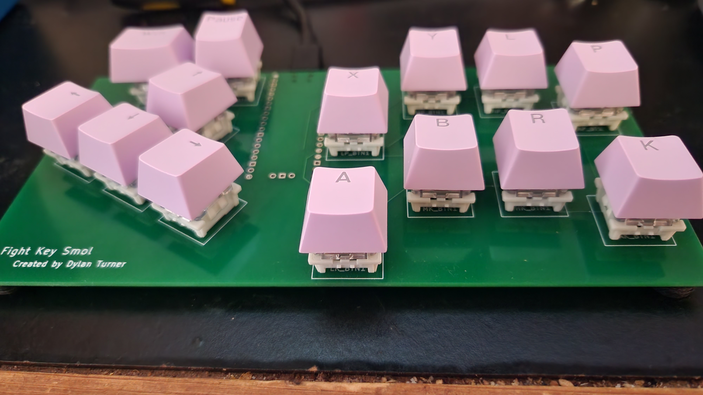
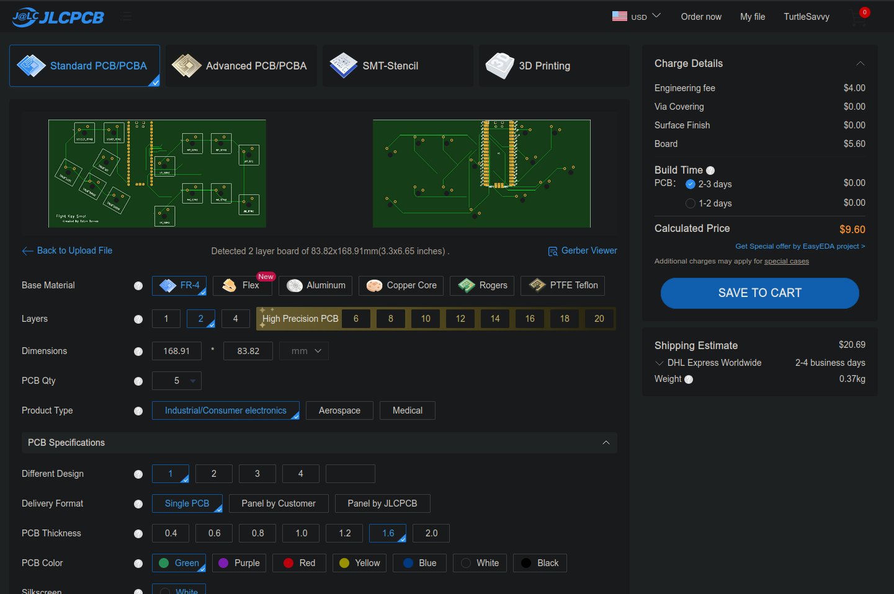
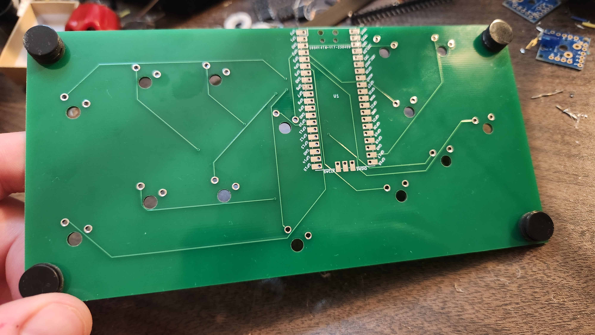
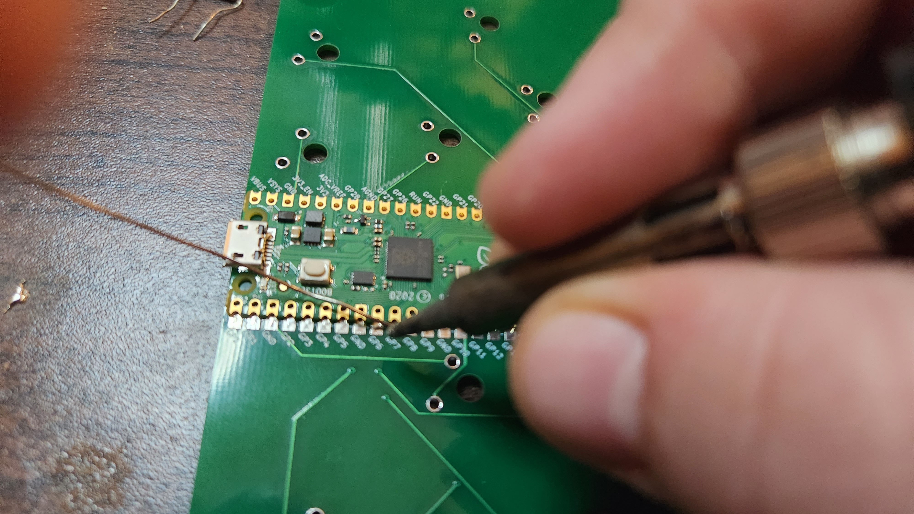
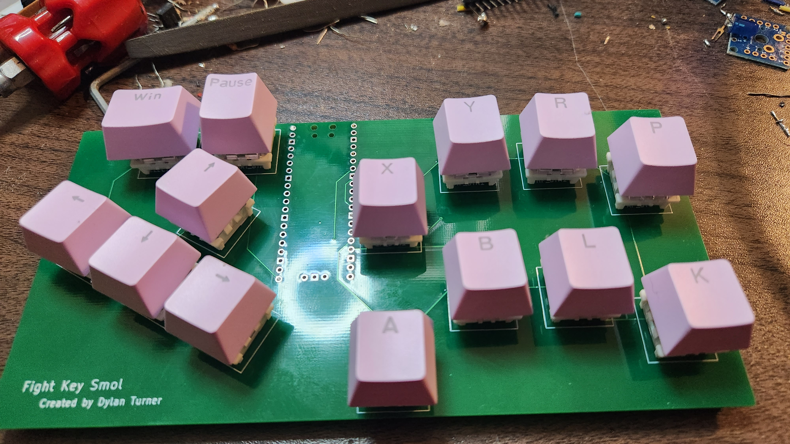
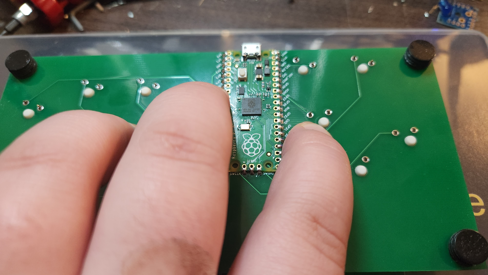
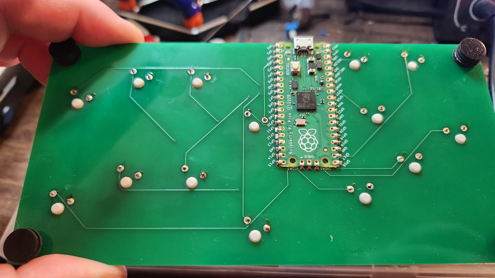
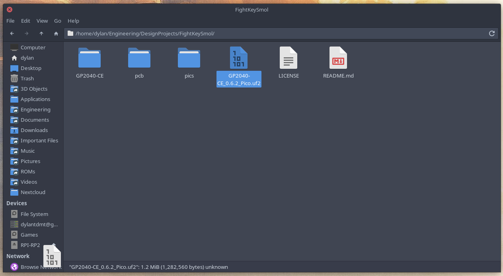

# Fight Key Smol

## Description

I made a [hitbox for myself](https://hackaday.io/project/185796-fight-key-wide) a while back that's big and has an enclosure and all that good stuff and cost me maybe $80 to make.

However, lately I've been seeing people pay well over $100 for something that should be maybe $50 max, so I'm redesigning that to fit the style people want, so there's a cheap alternative.

Now yes, you're paying for quality with the others. This doesn't come with an enclosure, and it's DIY; it's minimal, but for some people, that's worth not dropping >= $100. It's an option. That's all

So, this project aims to be a tiny, inexpensive, DIY, keyboard-based fighting-game controller.

## Parts

It currently costs \~$31 for materials, but shipping is another $20, so I will likely continue to look for more options to cut costs as even $50 is absurd.

| Part         | Link                          | Cost |
|:------------:|:-----------------------------:|:----:|
| PCB          | [Jlcpcb](https://jlcpcb.com/) | $10  |
| PCB Shipping | -                             | $20  |
| Switches     | [Amazon][SwitchLink]          | $7   |
| Key Caps     | [Aliexpress][CapLink]         | $2   |
| Pico         | [Amazon][PicoLink]            | $8   |
| Rubber Feet  | [Aliexpress][FeetLink]        | $2   |
| Total        | -                             | $49  |

There are probably cheaper ways to get parts like switches, but here's some starting points.

[SwitchLink]: https://www.amazon.com/Keyswitch-Replaceable-Switches-Mechanical-Keyboard/dp/B07V4S3QDK/ref=sr_1_1?crid=2KVKUIIAKWWWM&keywords=cherry+mx&qid=1680653938&refinements=p_85%3A2470955011&rnid=2470954011&rps=1&s=electronics&sprefix=cherry+mx%2Celectronics%2C119&sr=1-1 "Amazon"

[CapLink]: https://www.aliexpress.us/item/3256803462871478.html?spm=a2g0o.productlist.main.15.fd98sl21sl21Ub&algo_pvid=9ed2559f-ab14-4ea8-b05c-93050b38520c&algo_exp_id=9ed2559f-ab14-4ea8-b05c-93050b38520c-7&pdp_npi=3%40dis%21USD%211.5%211.12%21%21%21%21%21%4021224e9b16806567975486574d074d%2112000026645768333%21sea%21US%210&curPageLogUid=vViLogs9j2Z2 "Aliexpress"

[PicoLink]: https://www.amazon.com/seeed-studio-Raspberry-Microcontroller-Dual-core/dp/B08TQSDP28/ref=sr_1_5?crid=2AFT7S4T0WLWI&keywords=raspberry+pi+pico&qid=1680652784&s=electronics&sprefix=raspberry+pi+pico%2Celectronics%2C132&sr=1-5 "Amazon"

[FeetLink]: https://www.aliexpress.us/item/3256802824831274.html?spm=a2g0o.productlist.main.3.1d2euhP7uhP7xI&algo_pvid=2fb22ca9-1f01-4ad7-b061-13c82821ac5f&algo_exp_id=2fb22ca9-1f01-4ad7-b061-13c82821ac5f-1&pdp_npi=3%40dis%21USD%214.3%212.75%21%21%21%21%21%4021224e9b16806569370377705d074d%2112000023220982483%21sea%21US%210&curPageLogUid=p8IEdTjMobiL "Aliexpress"

## Subdirectories

- pcb - Fight Key Smol KiCAD PCB project
- GP2040-CE - submodule containing code.

## Build Instructions

1. Order the board from Jlcpcb. Can just use default options
   
2. Add feet.
   
3. Solder the pico to the board.
   
4. Add caps.
   
5. Solder the switches to the board.
   - Press down to make sure they all get put evenly. You may need to 
   - If not even, you can reheat a joint and push on the switch to adjust the angle.
   
   
6. Program the pico. You don't need to rebuild it.
   1. Press the pico's button down and plug it in to make it show up as a drive
   2. Copy the .uf2 file in the repo to the drive. It will unmount and program and auto-remount as a controller
   
7. Enjoy!

